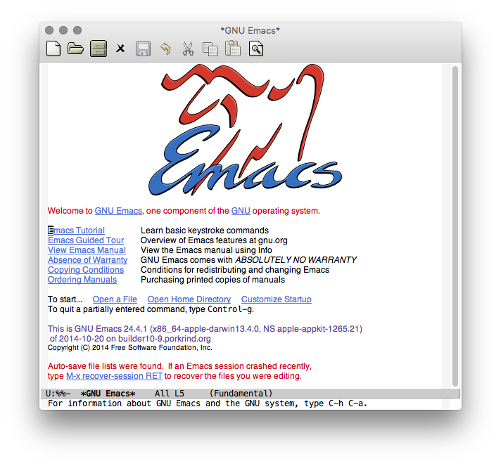
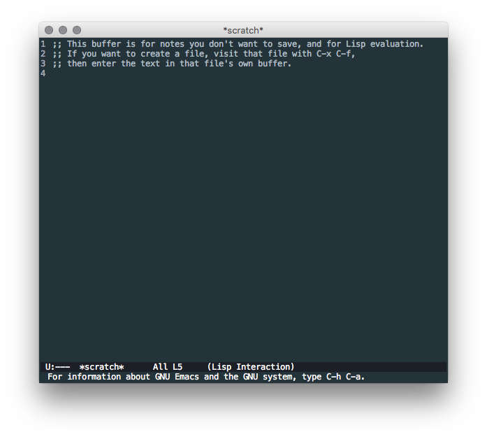
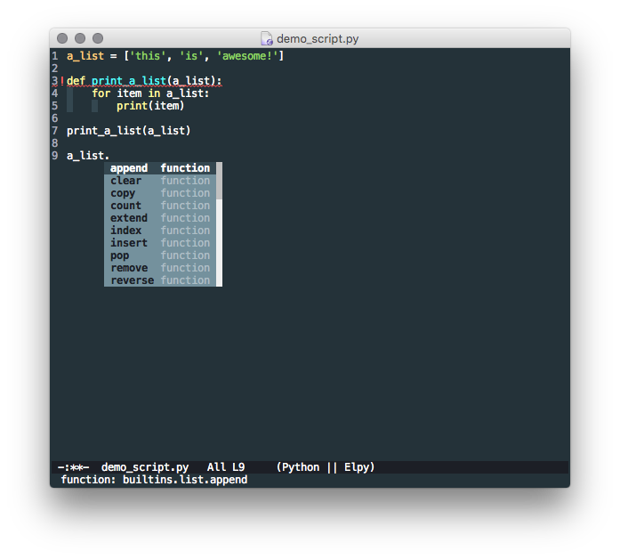
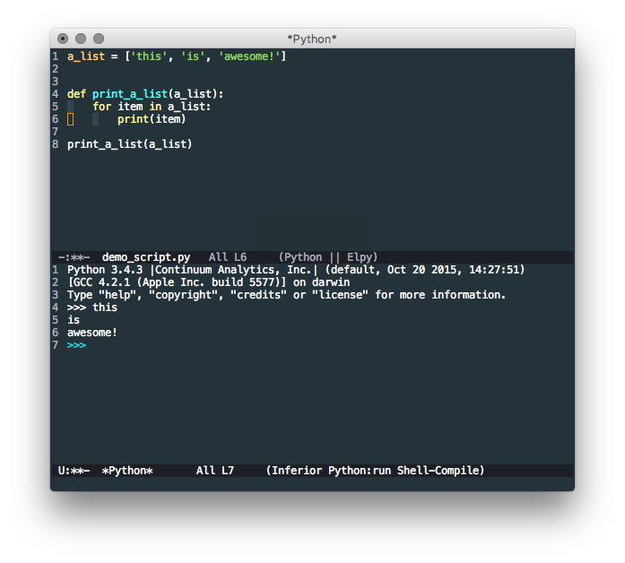
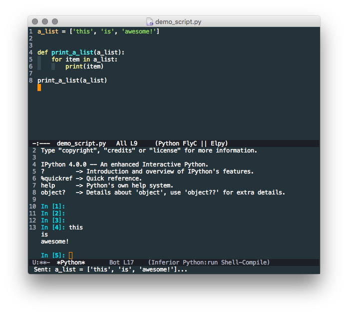
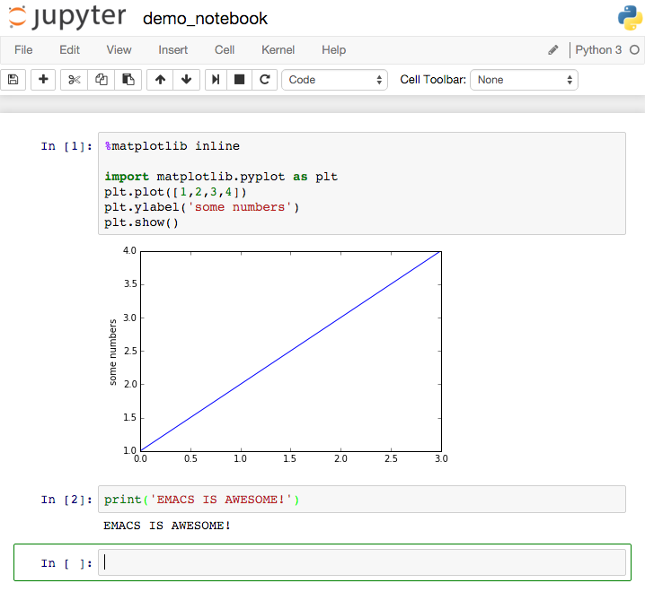
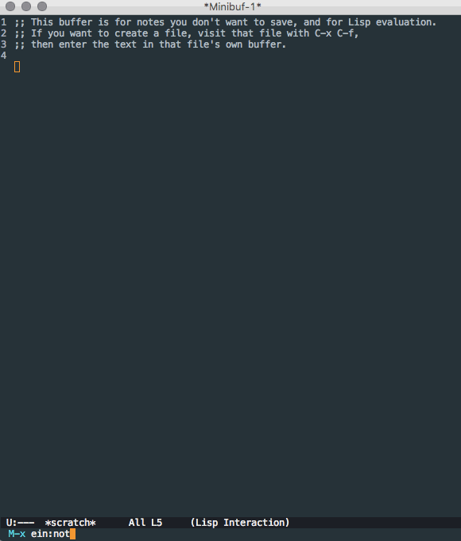
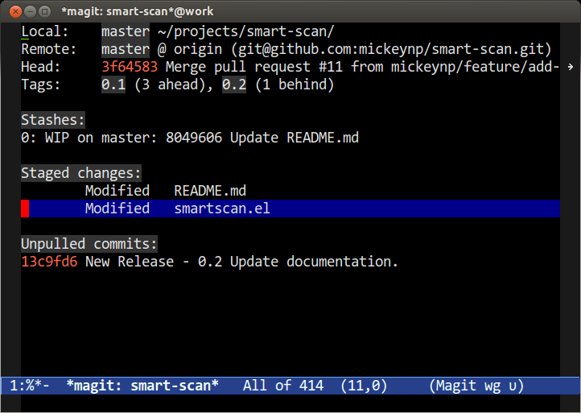

Title: Emacs - The Best Python Editor? (It's Pretty Good).
Date: 2015-10-27
Category: Software, Editors
Tags: python, development
Summary: Emacs is more than a capable IDE for Python.

A recent article [VIM and Python - a Match Made in Heaven](https://realpython.com/blog/python/vim-and-python-a-match-made-in-heaven/) was posted that showed how capable Vim is for Python development. I want to present the most common alternative to Vim, Emacs as an alternative for a Python development environment.

# Installation and Emacs Basics

## Installation

Installation of emacs is a topic that does not need to be covered in another blog post. [This Guide](http://ergoemacs.org/emacs/which_emacs.html) privided by [ergoemacs](http://ergoemacs.org/) will get you up and running with a basic emacs installation on Linux, Mac, or Windows. Once you have completed installation you will be greated with a fresh emacs on statup.



## Basic Emacs

Another topic that does not need to be covered is the basics of emacs. The easiest way to learn emacs is to follow the built-in tutorial. The topics covered in the post do not require you to know how to use emacs yet, rather they highlight what you can do after learning the basics.

> To enter the tutorial use your arrow keys to position the cursor over the words "Emacs Tutorial" and press Enter.

The following is the first passage from the tutorial and is important for some of the examples shown in the rest of this post.

```
Emacs commands generally involve the CONTROL key (sometimes labeled
CTRL or CTL) or the META key (sometimes labeled EDIT or ALT).  Rather than
write that in full each time, we'll use the following abbreviations:

 C-<chr>  means hold the CONTROL key while typing the character <chr>
	  Thus, C-f would be: hold the CONTROL key and type f.
 M-<chr>  means hold the META or EDIT or ALT key down while typing <chr>.
	  If there is no META, EDIT or ALT key, instead press and release the
	  ESC key and then type <chr>.  We write <ESC> for the ESC key.
```

Through the rest of the post I will show key entries like `C-x C-s` (save). This means I the control and x key at the same time and then the control and s key at the same time. This is the basic form of interacting with emacs.

## Configuration & Packages

One of the great benefits of emacs is the simplicity and power of configuration. The core of emacs configuration is the file `init.el` (el is emacs-lisp). For a unix environment this file should be put in `$HOME/.emacs.d/init.el` and for windows (if the *HOME* environment variable is not set) `C:/.emacs.d/init.el`. I will present configuration snippets throughout the post and will provide a complete basic emacs configuration for Python at the completion.

The core of customizing emacs is installing packages from various repositories. The primary emacs package repository is [melpa](https://melpa.org/#/). All of the packages presented in this article will be installed from this repository.

## Styling (Themes & More)

To start with some easy emacs customization here is the complete configuration file needed to install and apply a custom theme. My prefered theme is [material](https://github.com/cpaulik/emacs-material-theme) so we'll be using that for the rest of the post.

```emacs-lisp
;; init.el --- configuration initialization

;; INSTALL PACKAGES
;; --------------------------------------

(require 'package)

(add-to-list 'package-archives
	     '("melpa" . "http://melpa.org/packages/") t)

(package-initialize)
(when (not package-archive-contents)
  (package-refresh-contents))

(defvar myPackages
  '(better-defaults
    material-theme))

(mapc #'(lambda (package)
	  (unless (package-installed-p package)
	    (package-install package)))
      myPackages)

;; BASIC CUSTOMIZATION
;; --------------------------------------

(setq inhibit-startup-message t) ;; hide the startup message
(load-theme 'material t) ;; load material theme
(global-linum-mode t) ;; enable line numbers globally

;; init.el ends here
```

This config file is the basic setup we need to get installing package automatically and setting configuration options. The first section installs two packages (better-defaults and material-theme). better-defaults is just a collection of minor changes to the defaults in emacs and I always use it as a base. material-theme is the package that provides the material theme I mentioned. The second section (BASIC CUSTOMIZATION) does three things:

1. Disables the startup message (this is the screen with all the tutorial information). You may want to leave this out until you are more comfortable with emacs.
2. Loads the material theme.
3. Enables line numbers globally.

Enabling something globally means that it will apply to all buffers (open items) in emacs. This means if you open a python file, markdown file, and text file they will all have line numbers shown. You can enable things per mode (python-mode, markdown-mode, text-mode) and this will be shown later when setting up Python.

Now that we have this config we can restart emacs and see the changes. If you placed the `init.el` file in the correct default location it will automatically be picked up. As an alternative you can start emacs with `emacs -q --load <path to init.el>`. When loaded our initial emacs window looks a bit nicer!



With this basic configuration complete we can begin to dive into configuring Python!

# Elpy (Emacs Lisp Python Environment)

Emacs provides a python-mode out of the box that provides indentation and syntax highlighting. However to compete with python specific IDE's we'll certainly want more. The [elpy](https://elpy.readthedocs.org/en/latest/) package provides most of the other features we will want. Out of the box the elpy provides us with a near complete set of Python IDE (Integrated Development Environment) features, including:

* Automatic Indentation
* Syntax Highlighting
* Auto-Completion
* Syntax Checking
* Python REPL Integration
* Virtual Environment Support
* Much more!

To install and enable elpy we need to add a bit of configuration and install `flake8` and `jedi` using whatever method you prefer for installing Python packages.

```emacs-lisp
(defvar myPackages
  '(better-defaults
    elpy ;; add the elpy package
    material-theme))
```
and
```emacs-lisp
(elpy-enable)
```

Remember that a complete configuration including all the snippets I present will be included at the completion of the post. With the new configuration we can restart emacs and open up a Python file to see the new mode in action.



Shown is this image are the following features:

* Automatic Indentation (as you type and hit RET lines are auto-indented)
* Syntax Highlighting
* Syntax Checking (error indicators at line 3)
* Auto-Completion (list methods on line 9+)

In addition let's say we want to run this script. In something like IDLE or Sublime Text you'll have a buttom/command to run the current script. Emacs is no different, we simple type `C-c C-c` in our python buffer and ...



Often we'll want to be running a virtual environment and executing our code using the packages installed in that area. To use a virtual environment in emacs we simple typing `M-x pyvenv-activate` and follwing the prompts. You can deactivate a virtualenv with `M-x pyvenv-deactivate`. With this all of the basics of a Python IDE in emacs have been covered. Now let's put some icing on this cake!

# Additional Python Features

In addition to all the basic IDE features described above emacs allows us to do some additional things for Python. While this is not an exaustive list I'll cover pep8 compliance (with autopep8) and integration with IPython/Jupyter in this section. However before those I want to cover a quick syntax checking preference.

## Better Syntax Checking (Flycheck v. Flymake)

By default emacs with elpy comes wiht a package called flymake to support syntax checking. However another emacs package, flycheck, is availabel and support realtime syntax checking which is much better in my optinion. Luckily switching out for flycheck is just a tiny bit of configuration.

```emacs-lisp
(defvar myPackages
  '(better-defaults
    elpy
    flycheck ;; add the flycheck package
    material-theme))
```
and

```emacs-lisp
(when (require 'flycheck nil t)
  (setq elpy-modules (delq 'elpy-module-flymake elpy-modules))
  (add-hook 'elpy-mode-hook 'flycheck-mode))
```

Now we get realtime feedback when editing Python code.


## PEP8 Compliance (Autopep8)

Love it or hate it (love it is the correct answer) PEP8 is here to stay. If you want to follow all or some of the standards you'll probably want an automated way to do so. The [autopep8](https://pypi.python.org/pypi/autopep8/) tool is the solution. We will integrate it with emacs so that when you save `C-x C-s` autopep8 will automatically format and correct any PEP8 errors (excluding any you wish to). First you will need to install the Python package autopep8 with using your preffered method. We need to add the following config for emacs integation.

```emacs-lisp
(defvar myPackages
  '(better-defaults
    elpy
    flycheck
    material-theme
    py-autopep8)) ;; add the autopep8 package
```
and
```emacs-lisp
(require 'py-autopep8)
(add-hook 'elpy-mode-hook 'py-autopep8-enable-on-save)
```

Now (after forcing some pep8 errors) when we save our demo python file the errors will automatically be corrected.


## IPython/Jupyter Integration

Next up is a doozy, emacs integration with IPython REPL and Jupyter Notebooks. First let's look at swapping the standard Python REPL integration for the IPython version. For this we need just a tiny bit of configuration.

```emacs-lisp
(elpy-use-ipython)
```

Now when we run our Python code with `C-c C-c` we will be presented with the IPython REPL.



While this is pretty useful on it's own the real magic is the notebook integration. I'll assume that you already know how to launch a Jupyter Notebook server (if not [check this out](http://jupyter-notebook-beginner-guide.readthedocs.org/en/latest/what_is_jupyter.html)). Again we just need a bit of configuration.

```emacs-lisp
(defvar myPackages
  '(better-defaults
    ein ;; add the ein package (emacs ipython notebook)
    elpy
    flycheck
    material-theme
    py-autopep8))
```

The standard Jupyter web interface for notebooks is nice but requires us to leave our IDE to use.



However we can complete the exact same task by connecting to and interacting with the notebook server directly in emacs.



# Additional Emacs IDE Features

Now that all of the basic Python IDE features (and some really awesome extras) have been covered there are a few other things that an IDE should be able to handle. First up is git integration.

## Git Integration (Magit)

[Magit](http://magit.vc/) is the most popular non-utility package on melpa and is used by nearly every emacs user that uses git. It's incredibly powerful and far more comprehensive to cover in this post. Luckily [masteringemacs](https://www.masteringemacs.org/) has a great post covering magit [here](https://www.masteringemacs.org/article/introduction-magit-emacs-mode-git). The following image is from the masteringemacs post and gives you a taste for what the git integration looks like in emacs.



## Other Modes

I wanted to note that one of the major benefits of using emacs over a python specific IDE is that you get compatibility with much more than just Python. In a single day I often work with Python, Golang, JavaScript, Markdown, JSON, and more. Never leaving emacs and having complex support for all of these languages in a single editor is extremly efficient. You can check out my personal emacs configuration [here](https://github.com/kpurdon/kp-emacs). It includes support for:

* Python
* Golang
* Ruby
* Puppet
* Markdown
* Dockerfile
* YAML
* Web (HTML/JS/CSS)
* SASS
* NginX Config
* SQL

In addition to lots of other emacs configuration goodies.

## Emacs In The Terminal

After learning emacs you'll want emacs keybindings everywhere. This is as simple as typing `set -o emacs` at your bash prompt. However one of the powers of emacs is that you can run emacs itself in windowless mode in your terminal. This is my default environment. To do so just start emacs by typing `emacs -nw` at your bash prompt and you'll be running a headless emacs.

# Conclusion

As you can see emacs is clearly the best editor.

# Real Conclusion

Alright, alright there are lots of great options out there but I would absolutly reccomend learning either Vim or Emacs as they are by far the most versitle development environments possible. I said I'd leave you with the complete emacs configuration so here it is.

```emacs-lisp
;; init.el --- configuration initialization

;; INSTALL PACKAGES
;; --------------------------------------

(require 'package)

(add-to-list 'package-archives
	     '("melpa" . "http://melpa.org/packages/") t)

(package-initialize)
(when (not package-archive-contents)
  (package-refresh-contents))

(defvar myPackages
  '(better-defaults
    ein
    elpy
    flycheck
    material-theme
    py-autopep8))

(mapc #'(lambda (package)
	  (unless (package-installed-p package)
	    (package-install package)))
      myPackages)

;; BASIC CUSTOMIZATION
;; --------------------------------------

(setq inhibit-startup-message t) ;; hide the startup message
(load-theme 'material t) ;; load material theme
(global-linum-mode t) ;; enable line numbers globally

;; PYTHON CONFIGURATION
;; --------------------------------------

(elpy-enable)
(elpy-use-ipython)

;; use flycheck not flymake with elpy
(when (require 'flycheck nil t)
  (setq elpy-modules (delq 'elpy-module-flymake elpy-modules))
  (add-hook 'elpy-mode-hook 'flycheck-mode))

;; enable autopep8 formatting on save
(require 'py-autopep8)
(add-hook 'elpy-mode-hook 'py-autopep8-enable-on-save)

;; init.el ends here
```

Hopefully this configuration will spark your emacs journey!
